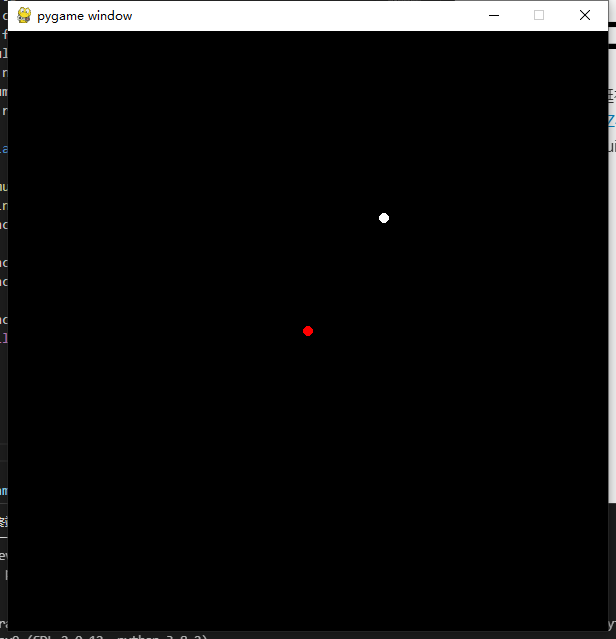

# 基于高二物理课本的物理引擎
高二时候写的，虽然不够优雅，但挺有意思，于是就发到github上。  
| 文件 | 功能 |
| ---- | ---- |
| core.py | 物理引擎核心 |
| forces.py | 各种力的定义 |
| main.py（原名render.py） | 渲染与程序入口 |  

演示视频：<a href="https://www.bilibili.com/video/BV16Z4y1V7gF">BV16Z4y1V7gF</a>  
使用前请安装requirements.txt中的包  

